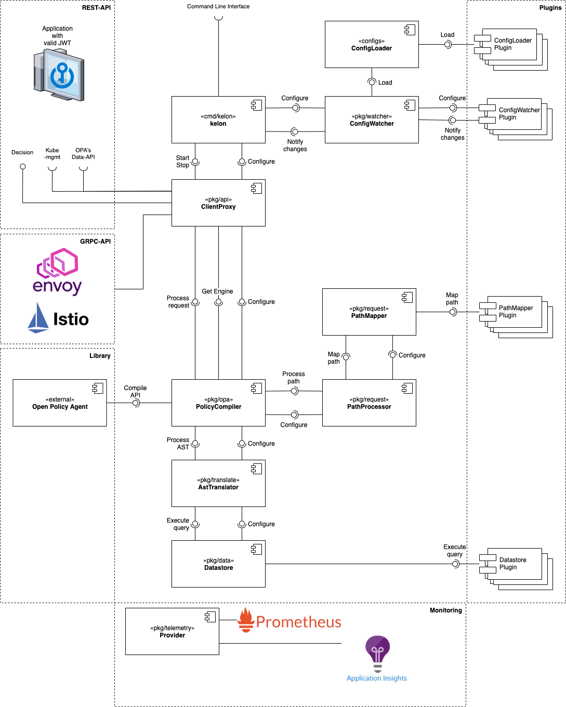

# Components

The main goal of Kelons core design was to make extensible with ease while keeping it functional and efficient. Therefore the entire applicaiton logic was divided into small closely coupled components which can be easily replaced by self implemented plugins.

Right now there is no mechanism for plugin loading, but as long as you implement Kelon's interfaces, you will be good to go when plugin-loading is available!