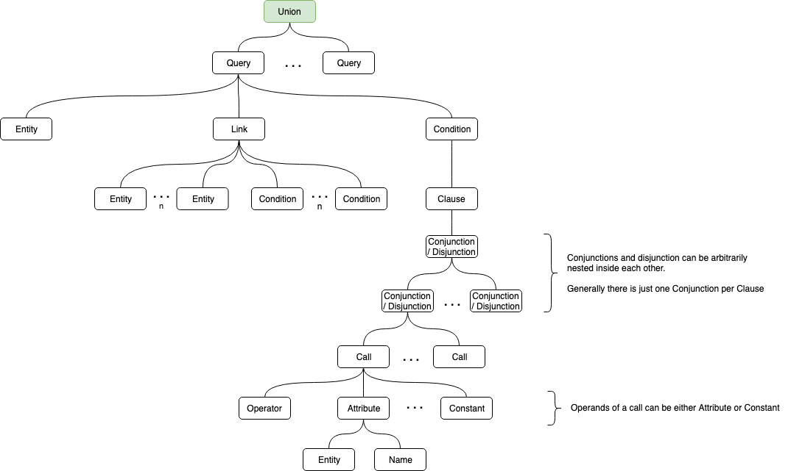

# Query AST

Each Datastore has the task to translate a so called Query-AST into its native query language (which might become important to you as your datastore isn't supported by kelon yet).
This means, that you have to Walk the entire Query-AST and translate it if you want to write your own Datastore-Plugin!

It is worth mentioning that the method 'Walk' of every Node of the Query-AST walks the entire node's subtree (Visitor Pattern) buttom-up & left-right including the calling node as last visit.