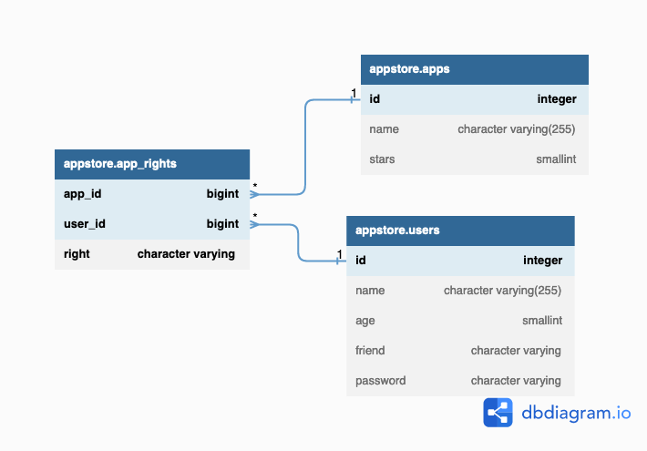

# Example

To get a first notion of what kelon does, we provide several [example setups](https://github.com/Foundato/kelon-examples) which all show a configuration of Kelon with three separate datastores (PostgreSQL, MySQL & MongoDB) in different environments. To demonstrate the ease of switching between datastores with kelon, all three datastores have the same data set.

In the following tutorial, we will walk through all steps needed to get a project together with kelon up and running.

## Datamodel

The datamodel is fairly simple but contains everything you will need in a more advanced setup (i.e. JOINS).

MySQL & PostgreSQL:



MongoDB:

```json
// Collection "apps"
[
  {
    id: <number>,
    name: <string>,
    stars: <number>,
    rights: [
      {
        right: <string>,
        user: {
          id: <number>,
          name: <string>,
          age: <number>,
          friend: <string>
        }
      }
    ]
  }
]

// Collection "users"
[
  {
    id: <number>,
    name: <string>,
    password: <string>, 
    age: <number>,
    friend: <string>
  }
]

```

## Example Dataset

### appstore.users

| id  | name   | password  | age  | friend      |
|-----|--------|-----------|------|-------------|
| 1   | Arnold | pw_arnold | 73   | John Connor |
| 2   | Kevin  | pw_kevin  | 21   | Kevin       |
| 3   | Anyone | pw_anyone | null | Anyone      |
| 4   | Torben | pw_torben | 42   | Daniel      | 

### appstore.apps

| id  | name                   | stars |
|-----|------------------------|-------|
| 2   | First App for everyone | 1     |
| 2   | Arnold's App           | 2     |
| 3   | Famous App             | 5     |

### appstore.app_rights

| app_id | user_id | right |
|--------|---------|-------|
| 2      | 1       | OWNER |


## Appstore example (Spring-Boot & Vue.js)

Bored of this "playground" example? Then go ahead and checkout our [Kelon-enabled fork](https://github.com/Foundato/spring-vue-appstore) of Daniel-Seifert's [spring-vue-appstore](https://github.com/Daniel-Seifert/spring-vue-appstore) which shows how to integrate kelon in a real-world szenario.