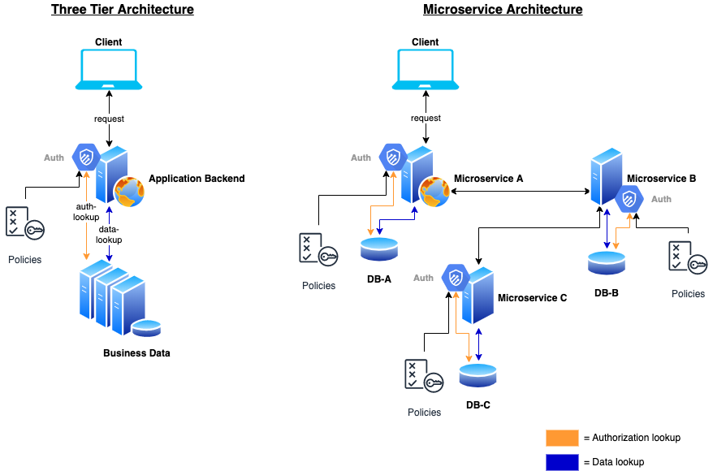
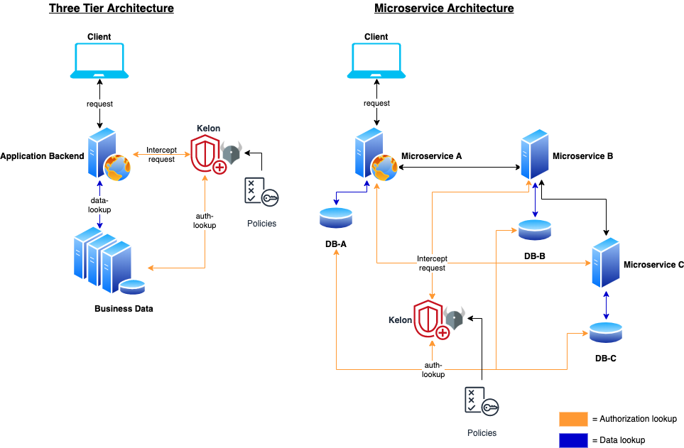

# Kelon

## About

Kelon is a policy enforcement point, that is wrapping the [Open Policy Agent](https://www.openpolicyagent.org) (OPA) by adding more functionality in terms of microservices.

## Motivation

Let's say you have some services you would like to have authorization implemented into. With this challenge in mind there are basically two options:

### 1. Use code to secure your endpoints

In case of REST-Services nearly every framework provides something like Guards or so

### 2. Use Kelon to secure your endpoints 

Just add some small code snippets to your service (like Request-Interceptors) and let Kelon handle the decision for you

## Conclusion

It's obvious that the second option not only increases the speed at which you'll implement your service (**focusing only on the functionality**), but also grants much more
security because **all** your **policies** are **stored and enforced in one place** (they can also be separately tested).

This is basically the problem that the Open Policy Agent solves. The only problem is that it is very hard to integrate
the OPA into a project because it needs the data which is needed to enforce policies to be stored inside it. This leads to work flows where
you copy an abstraction of your entire database into OPA which is not only redundant, but also leads to synchronization issues.

## Getting Started

Getting started with Kelon is as easy as following one of the How-To guides.

* [Example Setup](core/overview/Simple-Example.md)
* [Appstore example (Spring-Boot & Vue.js)](https://github.com/unbasical/spring-vue-appstore)