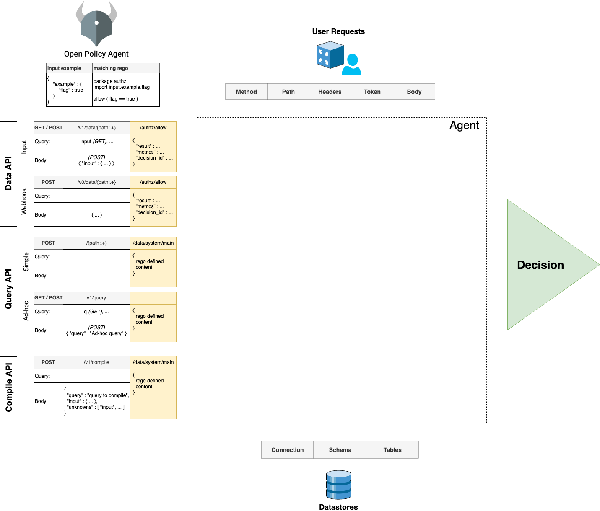
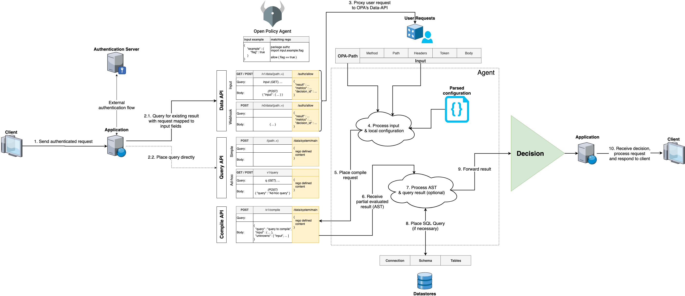

# Introduction

To get a better understanding of how kelon is built, have a look at following infographics to get a better understanding of the surrounding environment of Kelon.

## External interfaces

## Request flow

## Interface usage exploration

In order to intercept each request in your backend and send it to Kelon, you have to implement some kind of middleware in your backend.
All big backend-frameworks contain middleware-APIs which help you to write this interception with only a view lines of code.

Following interface usage exploration lists a view common frameworks and their authorization-middleware components.

Note the two different approaches of implementing the authorization-middleware (either by having one interceptor which sends all incoming requests to kelon or multiple interceptors).

We strongly recommend you to only use one interceptor!